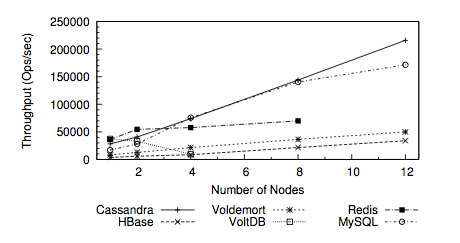
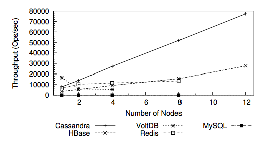
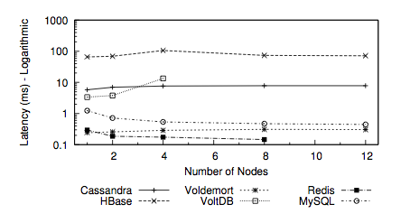
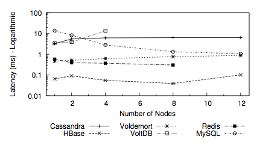
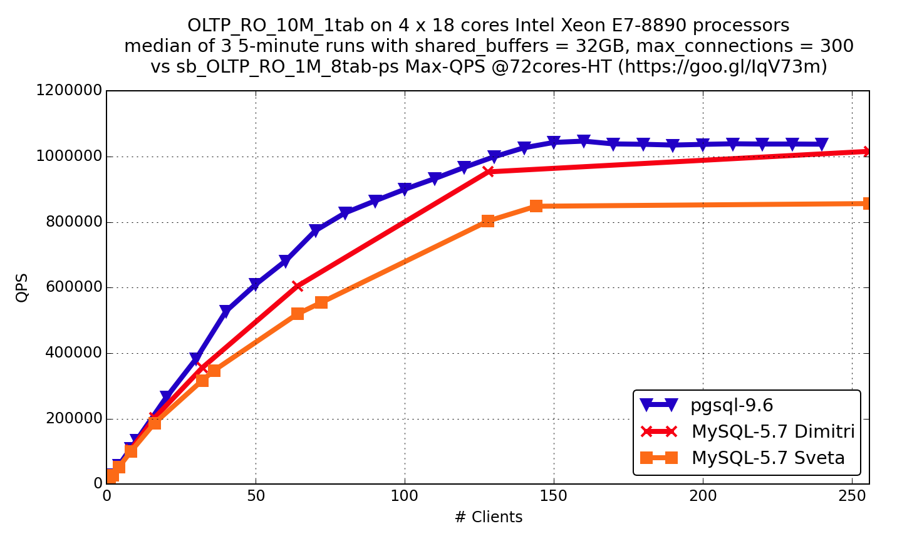
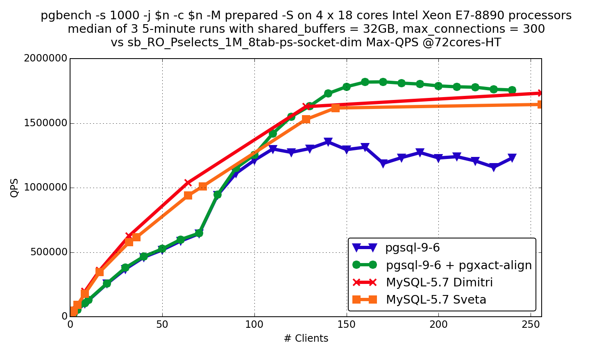
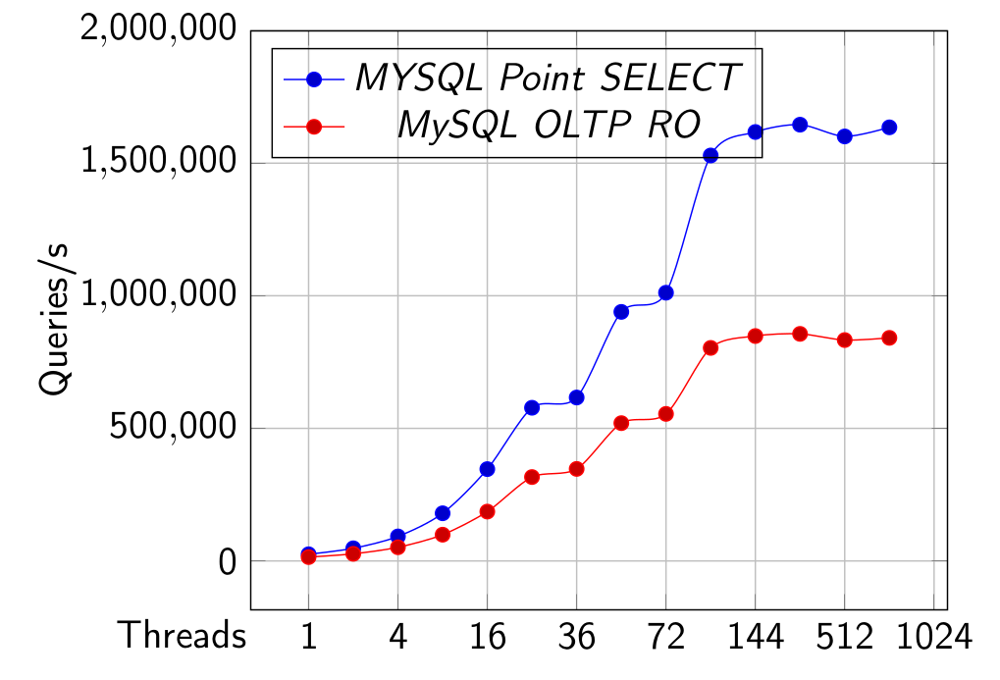
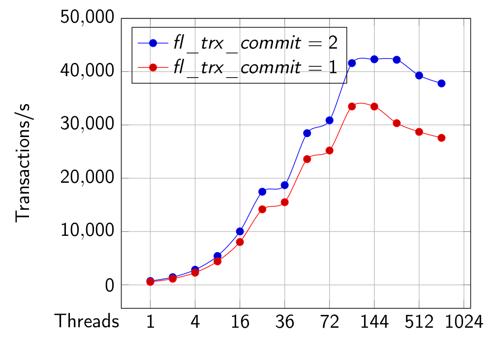

#Database compare

### Redis
Redis is an in-memory data store that offers extremely quick reads and writes relative to PostgreSQL, an on-disk relational database. Even better, it’s simple to specify when Redis should delete expired data.
[An alternative approach to rate limitingIs Cassandra Good For Read Operations](https://www.figma.com/blog/an-alternative-approach-to-rate-limiting/)  

### Cassandra  
Cassandra has an excellent single-row read performance as long as eventual consistency semantics are sufficient for the use-case. Cassandra quorum reads, which are required for strict consistency, will naturally be slower than Hbase reads. Cassandra also does not support Range based row-scans which may be limiting in specific use-cases.
[Is Cassandra Good For Read Operations](https://www.zymr.com/cassandra-good-read-operations/)  

### Performance compare

| Database        | Read (per sec)         | Write (per sec)  | Latency | Distributed
| ------------- |:-------------:| -----:|-----:|-----:|
| postgres     |  rdepend on machine , upto 1M QPS | depend on machine up to 1M QPS  | low |No
| mysql     |  depend on machine up to 1M QPS  | depend on machine up to 1M QPS  | low | no
| Redis     |  333333 | 312,500 | low | yes
| Cassandra     |  Depends one read level | 1M with 100node | high | yes
| Mongo3.0     |  1000 | 1500 | low | yes

----------------------
Throughput for workload Read/Write
Throughout ranks 
1. cassandra
2. Mysql
3. Redis
4. Voldemort
5. Hbase
6. VoltDB

----------------------
Throughput for workload Read/Scan/Write
1. cassandra
2. HBase
3. Redis
4. VoltDB
5. Mysql

----------------------
Read latency for workload Read/Write
Latency ranks best rank 
1. Redis
2. Voldemort
3. Mysql
4. VoltDB
5. cassandra
6. HBase

----------------------
Write latency for workload Read/Write
Latency ranks best rank 
1. HBase
2. Redis
3. Voldemort
4. Mysql
5. cassandra
6. VoltDB

----------------------

----------------------

----------------------

----------------------

----------------------

----------------------

##Reference:
[Fermi Estimates On Postgres Performance](https://www.citusdata.com/blog/2017/09/29/what-performance-can-you-expect-from-postgres/)  
[How many requests per second can I get out of Redis?](https://skipperkongen.dk/2013/08/27/how-many-requests-per-second-can-i-get-out-of-redis/)  
[University of Toronto NoSQL Database Performance](https://academy.datastax.com/planet-cassandra/nosql-performance-benchmarks)  
[One Million Writes / Sec](https://www.datastax.com/1-million-writes)  
[Is Cassandra Good For Read Operations](https://www.zymr.com/cassandra-good-read-operations/)  
[Mongo Mysql Test Performance in Nodejs](https://github.com/webcaetano/mongo-mysql)  
[PostgreSQL and MySQL: Millions of Queries per Second](https://www.percona.com/blog/2017/01/06/millions-queries-per-second-postgresql-and-mysql-peaceful-battle-at-modern-demanding-workloads/)
