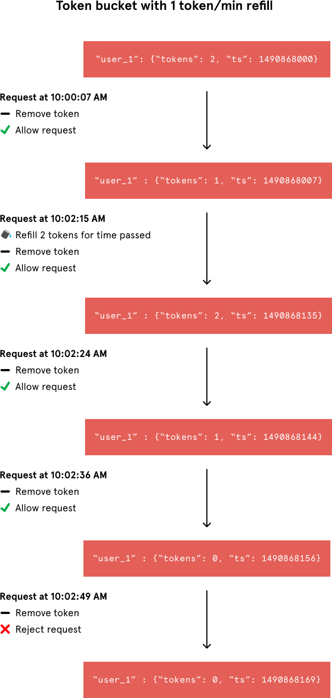
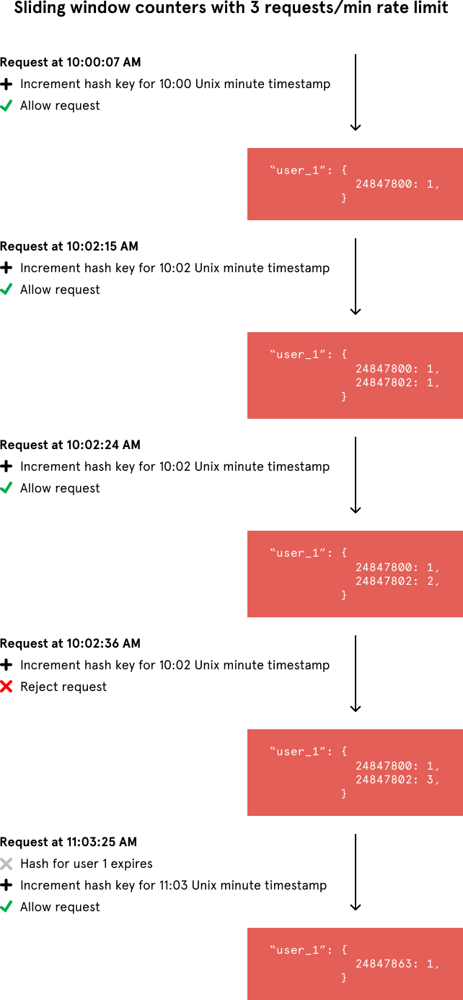

# Rate limiting

###leaking bucket , queue
- Pro
   1. Easy
- Con 
   1. Old request fill all Queue, recent request can joint before release. if request serve more than 10 second, then 
   with 10 second all request failed.Can not give a certain amount of request in paticular time.
   2. Single point of failure
---------------------------------
### Token bucket
User  user_id as key, counter + window_time_stamp as the value,
Suppose each user has a limit, refill rate is 1 message per min
when the request comes in 
    1. search by key
    2. refill 1 message * (current request window timestamp - last request window timestamp) / per second 
    3. if counter == 0 ,reject , otherwise reduce 1.
- Pro 
    1. easy implement.
- Con  
    1. refill and reduce counter need be to atomic operation. Our token bucket implementation could achieve atomicity if 
    each process were to fetch a Redis lock for the duration of its Redis operations.
    
---------------------------------
    
### Fix window  
Each window has a counter , if large than size reject
1. Use redis, 
2. username + window time stamp as key 
3.  retire key when time passed.
- Pro 
    1. It’s a simple, memory-efficient algorithm that records the number of requests from a sender occurring in the 
       rate limit’s time interval. Unlike the token bucket algorithm, this approach’s Redis operations are atomic. Each 
       request would increment a Redis key that included the request’s timestamp. 
- Con
    1. If window is 5 minute, first 5 come in at second half of time1, and another 5 come in first half or time 2, 
       actually 10 second comes in one minute
    2. need smaller window  
  
    
---------------------------------
### Sliding log  
track all timestamped log for each customer. Like the fixed window algorithm, it's tracking a counter for each fixed window.
retire outdated value.
1. Userid as key
2. value contains counter, and request time , not window time
3. value remove when window expire.
- Pro
    1. No stampede effect in fix window
- Con
    1. Expensive to save log

UserId as the key, total count for each window

    
---------------------------------

### Ref
[An alternative approach to rate limitingIs Cassandra Good For Read Operations](https://www.figma.com/blog/an-alternative-approach-to-rate-limiting/)  
